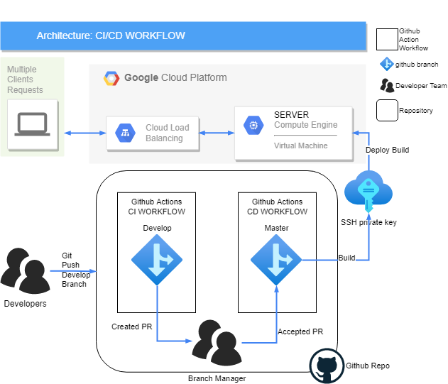

# Week 4 DEVOPS

Architecture diagram for the workflow followed by github actions in the different stages of the CI/CD pipeline defined.

The diagram shows the process of the flow but changes have been made in said flow in the creation of a docker image that contains all the resources for the correct functionality of the nginx server authentication and web page hosted.